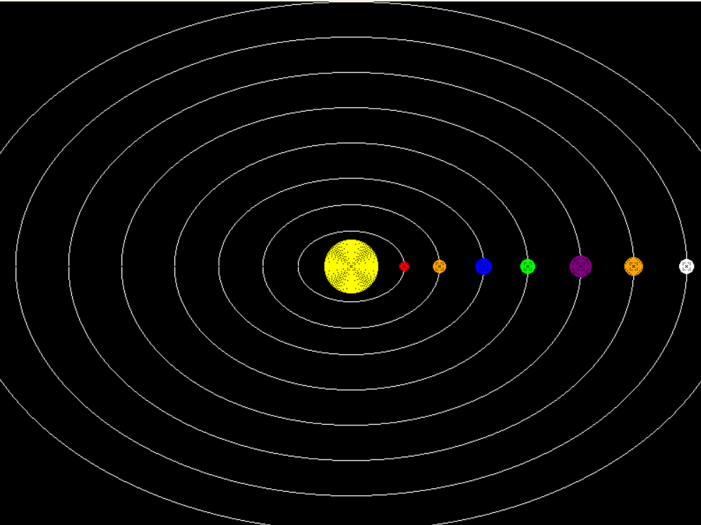

## Solar System Project

This is a Python project that visualizes a Solar System using Pygame. It uses the Mid-Point Ellipse and Mid-Point Circle Algorithms for drawing orbits and planets and looping technique for filling the colour in planets

### Purpose of this Project 

* Visualization of the solar system.
* Teaching and learning computer graphics concepts

## # Output Screenshot
